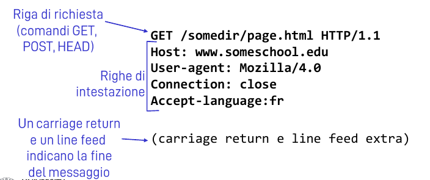
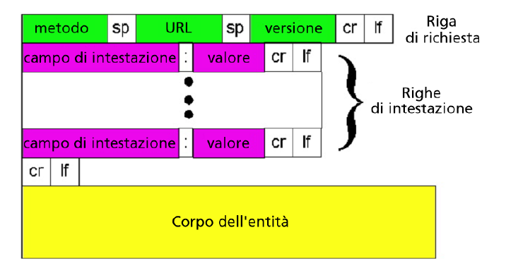
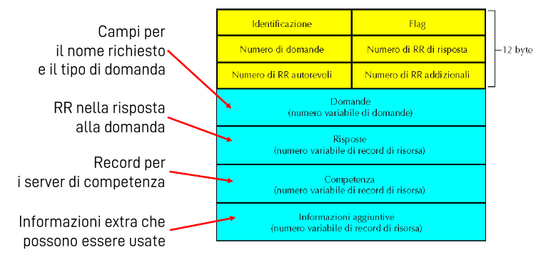
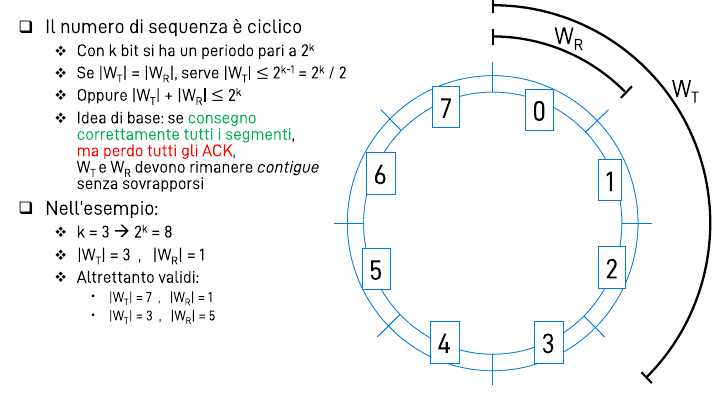
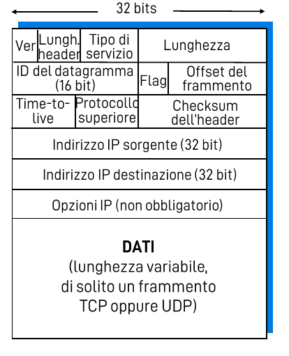
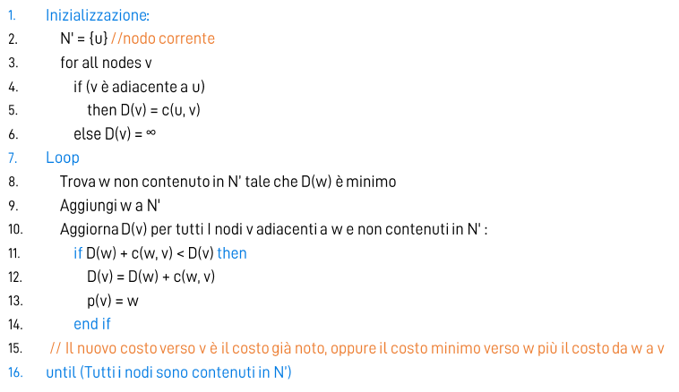
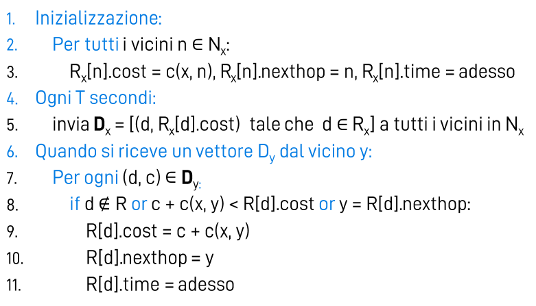
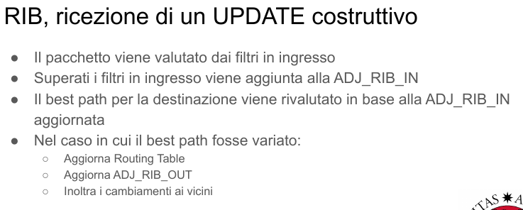
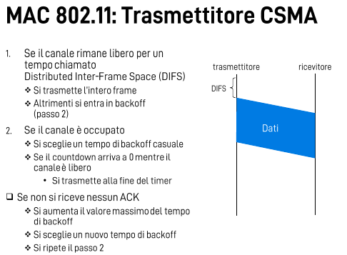
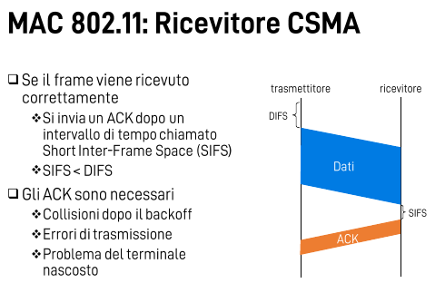

# Reti

**Paolo Casari, 2020**

## Introduzione

Internet si presenta con una **struttura gerarchica** e si compone della **rete pubblica** e delle **intranet private**.

### Ai confini della rete

|    Sistemi terminali (Host)     |                  Architettura Client/Server                  |                  Architettura peer to peer                   |
| :-----------------------------: | :----------------------------------------------------------: | :----------------------------------------------------------: |
| Eseguono programmi applicativi. | Tendenzialmente sono due programmi eseguiti su due sistemi terminali diversi. Uno richiede un servizio e l'altro lo fornisce. | Non esistono punti di interconessione centralizzati. Gli host comunicano direttamente fra di loro. |

#### Reti di accesso

1. **Residenziali**: Modem dial-up, DSL, Fiber to The Home (FTTH).
2. **Aziendali**: Lan (Ethernet).
3. **Wireless**: Lan Wireless, Wireless geografica.

####  Mezzi fisici guidati

- **Doppino interlacciato**: formato da due fili avvolti. La schermatura può essere per doppino, intero cavo, entrambe o nessuna. Denominazione: *X / Y TP*. X -> cavo, Y -> doppino.
- **Cavo coassiale** : due conduttori di rame concentrici, bidirezionale, uno o più canali sul cavo.
- **Fibra ottica**: conduce impulsi di luce, alta frequenza trasmissiva, basso tasso di errore, immune all'interferenza magnetica.

#### Mezzi ad onda libera

- **Microonde terrestri**, **Lan Wifi**, **wide-area**. **satellitari**.

  

### Il nucleo della rete

I dati vengono trasferiti attraverso la *commutazione di circuito* (circuito dedicato per la sessione) o quella *di pacchetto* (i messaggi di una sessione utillizzano risorse su richiesta).

#### Commutazione di circuito

Le risorse di rete sono suddivise in porzioni, per esempio in base alla frequenza o al tempo (FDM o TDM). Ciascuna porzione è allocata ai vari collegamenti, se una risorsa è inutilizzata rimane inattiva.

#### Commutazione di pacchetto

In questo caso le risorse vengono usate a seconda delle necessità, vengono inoltre condivise e ogni pacchetto utilizza completamente il canale. Questo metodo può generare **congestione** (pacchetti in attesa del collegamento) dovuta anche allo **store and forward** dei commutatori. Quest'ultimo richiede che l'intero pacchetto arrivi al router prima che questo lo ritrasmetta. Rispetto alla commutazione di circuito consente a più utenti di usare la rete **contemporaneamente**, è ottima per i dati a raffica ma è necessario gestire la congestione e garantire affidabilità.

#### Internet è una gerarchia

- Al centro **ISP di livello 1**: comunicano come peer e hanno copertura nazionale/internazionale.
-  **ISP di livello 2**: comunicano tra di loro come peer, e con alcuni ISP di livello 1 che pagano per avere accesso al resto della rete; hanno copertura nazionale/distrettuale.
- **ISP di livello 3 o locali**: sono clienti degli ISP di livello più alto e sono a diretto contatto con i sistemi terminali.

Gli **IXP** sono dei punti in cui gli **ISP di livello 2** si incontrano e comunicano.

### Ritardi, perdite e throughtput

Ci sono 4 tipi di ritardo (commutazione di pacchetto):

|     Ritardo di elaborazione del nodo *dproc*      |          Ritardo di accodamento *dqueue*          |
| :----------------------------------------------------------: | :----------------------------------------------------------: |
| Dovuto al controllo di errori e alla scelta del link di ritrasmissione. | Dovuto all'attesa di trasmissione e dipende soprattutto dal livello di congestione dei router. |

| Ritardo di trasmissione *dtrans* | Ritardo di propagazione *dprop* |
| ------------------------------------------- | ------------------------------------------ |
| **L/R**                                     | **d/s**                                    |

> **R**: frequenza di trasmissione del collegamento *bit/s*
>
> **L**: lunghezza del pacchetto *bit*
>
> **s**: velocità di propagazione nel mezzo fisico *m/s*
>
> **d**: lunghezza del collegamento fisico *m*

**Ritardo di nodo**: *dproc* + *dqueue* + *dtrans* + *dprop*

La **perdita di pacchetti** è dovuta alla capacità finita delle code (buffer dei router). Se la coda è piena il pacchetto viene semplicemente scartato.

Il **throughtput** è la frequenza alla quale una certa unità dati viene trasferita tra mittente e ricevente. Può essere istantaneo o medio. Spesso in collegamenti end-to-end risulta essere R del collo di bottiglia.

### Livelli di protocollo

La struttura di un'architettura di rete è organizzata in livelli perchè ne facilita l'aggiornamento e la manutenzione. Inoltre le modifiche ad un modulo non procano instabilità al sistema poichè trasparenti allo stesso. Ogni **Layer** utilizza le proprie funzionalità e i servizi del livello inferiore per fornire servizi al livello superiore. L'interfaccia di programmazione che permette di fruire e offrire servizi è chiamata **Service Access Point**. La comunicazione fra entità dello stesso layer è regolata da un **protocollo**.

#### Pila di protocolli internet

1. **Applicazione**: di supporto alle applicazioni di rete
2. **Transporto**: trasferisce i segmenti fra processi
3. **Rete**: instrada i datagrammi dalla sorgente alla destinazione
4. **Link**: instrada i frame attraverso una serie di commutatori di pacchetto
5. **Fisico**: trasferimento dei singoli bit

#### Data Units

- I dati da trasmettere del livello superiore sono una **(N+1)-SDU (Service Data Unit)**
- Le informazioni (**N-PCI Protocol Control Information**) di questo livello vengo inserite nella **(N+1)-SDU** come header o come trailer per formare la **N-PDU (Protocol Data Unit)**.
- La **N-PDU (Protocol Data Unit)** del livello N diventa la **(N-1)-SDU** ossia i dati da trasmettere dal livello sottostante.

Le PDU possono essere assemblate, segmentate e ri-assemblate.

### Sicurezza di Rete

Il malware può raggiungere gli host attraverso:

- **Cavalli di Troia**: parte nascosta di software utile 
- **Worm**: l'infezione proviene da un oggetto passivamente ricevuto che si auto-esegue
- **Virus**: l'infezione proviene da un oggetto passivamente ricevuto che viene eseguito

Altri attacchi di malintenzionati:

- **Packet sniffing**

- **Attacchi Dos e DDos** 

- **IP Spoofing**

- **Record and Playback**

## Livello applicazione

> **Architetture di rete**

| Client/server | Peer-to-peer puro | Ibridi | Cloud computing |
| ------------- | ------------ | ------ | --------------- |
| **Server**: sempre attivo con indirizzo ip pubblico e statico | Nessun server attivo, la comunicazione avviene fra coppie arbitrarie di host. | In questo   caso il server centrale viene utilizzato solo per rintracciare gli altri peer e iniziare la comunicazione . | Viene fornita la possibilità di memorizzare , archiviare e elaborare dati utilizzando solo risorse distribuite e virtualizzate in rete. |
| **Client**: temporaneamente attivo, indirizzo ip dinamico, non comunica con altri client solo con il server. | **Difficile da gestire ma facilmente scalabile.** |        |                 |

#### Alcune informazioni

Un **processo** è un 'programma' (non sempre vero) in esecuzione su di un host, processi su host differenti comunicano attraverso una **socket** che li consente di scambiarsi messaggi. Una socket è analoga ad una porta, infatti è possibile identificare univocamente un processo tramite la coppia **<ip - porta>**.

Un'applicazione potrebbe richiedere diversi tipi di servizi dal livello di trasporto, per esempio: temporizzazione, thotghtput, sicurezza o perdita di dati.

### Web e HTTP

Una **pagina web** è costituita da un insieme di *oggetti*, ma generalmente è un file base HTML in cui sono referenziati una serie di oggetti tramite un URL (Uniform Source Locator). Il protocollo **HTTP** è **client/server**, usa **TCP:80** ed è **stateless**. In HTTP è possibile inizializzare **connessioni non persistenti** (in cui viene trasferito *uno e uno* solo oggetto) e **connessioni persistenti** (attraverso una singola connessione TCP si inviano più oggetti). Ossia, nota la definizione di **RTT** (Round Trip Time), in una connessione persistente è necessario un RTT per oggetto, mentre in quelle che non lo sono ne servono 2.

#### Richiesta HTTP

--------

##### User riendly

##### Struttura

`

La richiesta può essere fatta principalmente con due metodi:

- **POST**: l'input del form arriva al server nel corpo dell'entità
- **GET**: l'input arriva al server nel campo dell'URL

Brevemente alcuni codici di risposta di un web server: **200** OK, **301** Moved Permanently, **400** Bad Request, **404** Not Found.

#### Cookies

Aggirano la caratteristica stateless di HTTP e permettono di salvare alcune informazioni riguardo alle sessioni; attraverso i cookie i siti imparano e ricordano cose su chi li visita.  Sono composti da quattro componenti:

**Intestazione richiesta - intestazione risposta - file sul terminale - database sul sito**

#### Cache web (server proxy)

Installare una **cache** in un server proxy riduce i tempi di risposta alle richieste dei client e riduce il traffico sul collegamento di accesso ad internet. La cache opera sia da **server** che da **client**, i broswer nella rete privata richiedono un oggetto alla cache che risponde **se è presente e non scaduto**; altrimenti è lei a richiederlo alla sorgente per poi conservarlo per successive richieste. Lo fa con un **GET condizionale** che presenta l'intestazione *if-modified-since*.

### FTP - File Transfer Protocol

Protocollo **client/server** over **TCP** alla porta **21** per l'autenticazione e **20** per il trasferimento dati. Una volta che il server FTP autorizza un client, apre una connessione per ogni file che desidera scaricare. Il client può spostarsi fra le directory e il server **mantiene lo stato** della connessione.

### Posta elettronica

È composta da tre componenti: 

- **Agente utente**: composizione, editing, lettura dei messaggi (Thunderbird, ecc.)

- **Server di posta**: contiene la coda di messaggi da trasmettere, la casella con i messaggi in arrivo e utilizza il protocollo SMTP per comunicare con gli altri server di posta.

- **SMTP**: TCP:25 protocollo diretto fra server di posta (e mittente-server di posta), tre fasi di comunicazione (handshake - messaggi - chiusura), messaggi in ASCII 7 bit, connessioni persistenti.

  > **Base 64**
  >
  > Attraverso l'intestazione MIME è possibile inserire nei messaggi elementi multimediali, solitamente codificati in base64. Formato in cui ogni sei bit vengono codificati in 8 (inefficiente).

  ##### Protocolli di accesso alla posta

  - **POP3** (*Post Office Protocol*): protocollo stateless like HTTP tra le varie sessione, modalità scarica e mantieni/cancella previa autenticazione;
  - **IMAP** (*Internet Mail Access Protocol*): presenta nativamente funzioni più complesse di POP3, consente l'organizzazione in cartelle e mantiene lo stato fra le sessioni. Inoltre i messaggi vengono conservati solo sul server.
  - **HTTP**: gmail...

### DNS (Domain Name System)

Consente la risoluzione di **nomi di dominio** tramite un database distribuito (porta impagabili vantaggi) implementato in una serie di server DNS organizzati in una **gerarchia**. Servizio che permette di tradurre un hostname in un indirizzo IP; nel caso di sistemi distribuiti (Mail server, servizi web di dimensioni enormi) permette di raggruppare un insieme di server sotto lo **stesso nome canonico**.

#### Gerarchia dei Server DNS

-  **Server DNS radice**: contattato da un server locale che non riesce a tradurre il nome e che vuole ottenere la mappatura.
- **Server Top Level Domain**: si occupano di edu, com, net... e domini locali di alto livello it, fr....;
- **Sever di competenza**: ogni organizzazione con host pubblicamente raggiungibili deve averne uno;
- **Server DNS Locale**: è il default name server, ogni volta che un host ha bisogno di una risoluzione DNS, invia la richiesta a questo server.

#### Queries

- **Ricorsiva**: la traduzione viene affidata al server contattato;

- **Iterativa**: il server contattato risponde con il server da contattare se non ha la risposta.

#### Messaggi DNS

  Tipi del Resource Record:

| A               | CNAME                       | NS                                     | MX                      |
| --------------- | --------------------------- | -------------------------------------- | ----------------------- |
| nome Host -> IP | nome alias -> nome canonico | dominio x -> server di competenza di x | nome -> server di posta |

##### Esempio

`

### Peer-to-Peer

Questo tipo di architettura **non** presenta un **server sempre attivo**, i peer hanno un indirizzo ip **dinamico** e comunicano direttamente fra di loro. 

#### Distribuzione di file - piccolo confronto

**Tempo per il trasferimento di F**

**dcs = max { NF/us, F/min(di) }**

**dP2P = max { F/us, F/min(di), NF/(us + $\Sigma$iui) }**

> us = bit rate di upload del server
>
> ui = bit rate di upload dell'i-esimo peer
>
> di = bit rate di download dell'i-esimo peer

#### Ricerca di informazioni 

Avviene solitamente tramite un indice, implementato come una **HashTable distribuita**. Nel file sharing tiene traccia della posizione dei file mentre nella messaggistica della posizione degli utenti. Usare un **server centralizzato** per l'indice porta notevoli svantaggi: single-point-of-failure, prestazioni e violazione del diritto d'autore.

#### Query flooding e copertura gerarchica

Protocollo **completamente distrubuito** che va a creare una rete di copertura virtuale sui peers. Il messaggio di richiesta viene inviato dai vicini e ri-inoltrato da questi. Tutti i peer hanno un indice dei file di cui dispongono. L'unione fra il **query flooding** e il **server centralizzato** dà forma alla **copertura gerarchica**, nella cui rete di copertura si distinguono dei gruppi di peer; il leader di ogni gruppo detiene l'indice dei file dei propro figli ed è connesso tramite TCP ad altri peer (Skype).

#### Bit torrent

> **Tracker**: server che tiene traccia dei peer che partecipano
>
> **Torrent**: gruppi di peer che si scambiano parti di un file

Il file da trasmettere viene diviso in parti (chunk). Quando un peer entra a far parte di un torrent si registra fra i tracker; mentre scarica il file può allo stesso tempo inviare le parti che ha già scaricato. Ogni 10 secondi vengono rivalutati 4 preferiti con cui si stanno scambiando chunk (inviando). Ogni 30 secondi viene selezionato anche un altro peer.

### Cloud computing

Nel caso di youtube i contenuti più popolari vengono spostati sulla **Content Delivery Network** in modo da avvicinarle agli utenti. Due filosofie accompagnano le CDNs:

- **Enter deep**: installare i server nelle reti degli ISP in tutto il mondo, ritardo e throughtput migliorati
- **Bring home**: meno server ma installati negli IXP

## Livello di trasporto

Fornisce la comunicazione logica fra **processi**. Dispone di due protocolli:

|                             TCP                              |                             UDP                              |
| :----------------------------------------------------------: | :----------------------------------------------------------: |
| Affidabile, consegne in ordine originario, controllo di congestione, controllo di flusso, handshaking. Una socket TCP è identificata da 4 parametri; un host server può supportare più socket TCP e un server web crea una socket per ogni client. | Inaffidabile, consegna senza ordine, consegna best effort, protocollo minimale. Una soclet UDP è identificata da 2 parametri e datagrammi IP con IP source e source port differenti ma dest port uguale vengono passati allo stesso processo. |

**Servizi non disponibili: garanzie sui ritardi e sull'ampiezza di banda.**

### Multiplexing e Demultiplexing

Il **multiplexing** viene effettuato dal trasmettitore aggiungendo l'header di livello 4 per identificare la socket a cui inviare i dati e riceverli succesivamente. Il **demultiplexing** viene effettuato dal ricevitore e utilizza l'header di trasporto per consegnare i segmenti alle socket corrette. Un processo in ascolto su un host è identificato da una porta che è indentificata da 16 bit e ha una mappatura biunivova con un processo. Le porte disponibili su un host si dividono in:

- **Statiche**: destinate a processi e servizi standard
- **Dinamiche**: possono essere scelte dal programmatore o asccegnatte casualmente dal SO.

### UDP

Caratteristiche:

- **no handshaking (ritardo ulteriore)**
- **header corti**
- **semplice e minimale**
- **senza controllo di congestione (raffiche di pacchetti)**
- **massimo sforzo**
- **utilizzato in applicazioni multimediali e DNS**

#### Checksum UDP

**Mittente**: somma tutte le parole da 16 bit e calcola il complemento a 1 della somma

**RIcevente**: somma tutte le parole da 16 bit e il checksum, se il risultato è tutti 1 è corretto (ma non preciso del tutto). Correzione e rilevazione degli errori è effettuata tramite **bit di parità** o **codice a ripetizione**.

### Principi del traferimento affidabile

**ARQ**: classe di protocollo per il recupero di pacchetto persi che utillizza degli **ack** per notificare la corretta ricezione dei pacchetti.

 #### Stop and wait

Il **trasmettitore** invia una PDU e imposta il timeout, se non riceve l'ack entro il timeout invia di nuovo il pacchetto. Se lo riceve lo controlla (errori e numero di sequenza). Il **ricevitore** controlla errori e numeri di sequenza; se è tutto corretto passa la SDU ai livelli superiori e invia l'ack. 

#### Protocolli con pipeling

Il trasmettitore e il ricevitore memorizzano i segmenti e viene tenuta traccia dei pacchetti in volo (per cui non è ancora stato ricevuto l'ack); **Go-back-N** e **selective repeat**. Il pipeling aumenta l'utilizzo del link; N paccchetti inviati per RTT è la dimensione della finestra.

> **Finestra di trasmissione WT**: insieme di PDU che il trasmettitore può accettare che siano in volo.
>
> **Finestra di ricezione WR**: insieme di PDU che il ricevente può accettare e archiviare.
>
> **Puntatore low WLOW**: puntatore al primo pacchetto di WT
>
> **Puntatore low WUP**: puntatore all'ultimo pacchetto già trasmesso.

> **Acknowledgements**
>
> ACK individuale: ack(n) -> ho ricevuto il pacchetto n
>
> ACK cumulativo: ack(n) -> ho ricevuto tutti i pacchetti fino a n (escluso)

|                        **Go-back-N**                         |                     **Selective repeat**                     |
| :----------------------------------------------------------: | :----------------------------------------------------------: |
|          FIno a N pacchetti senza ack in pipeline.           |          FIno a N pacchetti senza ack in pipeline.           |
|              Solo ack cumulativi dal ricevente.              |                    Solo ack individuali.                     |
|           Timer solo per il pacchetto più vecchio.           | Timer solo per ogni singolo pacchetto, ritrasmette solo quelli senza ack. |
| \|WT\| $<= 2^k -1$, non accetta segmenti fuori sequenza: la finestra di ricezione è unitaria | Nell'esempio sotto se si perdono tutti gli ack le due finestre devono rimanere contigue. |

### TCP

Caratteristiche:

- **Punto-punto**
- **Affidabile e consegne in ordine** 
- **Pipeling: ack cumulativi**
- **Controllo di congestione**
- **Full duplex**
- **Orientato alla connessione**
- **Controllo di flusso**

#### Finestra di ricezione (RWND)

Indica il numero massimo di byte che il destinatario può accettare e di coseguenza anche la massima quantià di dati in transito in un RTT. Può essere scalato assumendo multipli di byte.

> **Numero di sequenza**: numero del primo byte del segmento nel flusso di byte
>
> **ACK**: numero di sequenza del prossimo byte atteso
>
> Inenrambi si parla di *byte e non di segmenti*

#### Three way handshake e chiusura

**Client**: SYN = 1 nseq=x

**Server**: SYN = ACK = 1 nseq = y nack = x+1

**Client**: ACK = 1 nseq=x+1 nack = y + 1

##### Chiusura 

**Gentile**: si invia un segmento con FIN=1 e si riceve un FIN,ACK; se accade in **entrambe le direzioni** la connessione è half-closed.

**Brusca**: si invia un segmento con RST=1, viene utilizzato per chiudere connessioi velocemente o ingestibili.

#### MSS (Maximum Segment Size)

Con questo termine ci si riferisce alla lunghezza massima del **payload** del segmento. Dipende dal MTU del livello IP e conta tutto il percorso del segmento in internet. TCP cerca di inviare segmenti lunghi quanto un MSS e per trovarlo prova con numeri sempre più grandi finchè non ci si accorge che qualche segmento viene perso.

#### Come impostare il RTO (Retrasmission Time Out)

EstimatedRTT = $(1 - \alpha)*EstimatedRTT + \alpha*SampleRTT$

DevRTT = $(1-\beta)*DevRTT + \beta*|SampleRTT - EstimatedRTT|$

RTO = EstimatedRTT + 4*DevRTT

#### Controllo di flusso

Il ricevitore comunica quanto spazio libero ha nel buffer di ricezione in modo da evitare problemi di overflow. Il mittente fa la cortesia di inviare dati in modo che in volo ce ne siano al massimo RWND.

### Principi del controllo di congestione

Si manifesta con pacchetti persi e ritardi lunghi, la rete non riesce a gestire così tanto traffico.

- **Buffer infiniti**: ritardi molto elevati.
- **Timeout - ritardi dovuti alla congestione**: spreco di risorse
- **Pacchetti scartati**: ritrasmissioni.

### Controllo di congestione in TCP

L'approccio usato da TCP è un controllo di congestione end-to-end dove si capisce se c'è congestione dalla perdita di pacchetti o dai ritardi.

> **RWND**: finestra di ricezione, insieme di dati che possono essere gestiti dal ricevitore
>
> **CWND**: finestra di congestione, insieme di dati che possono essere gestiti dalla rete, aumentandola ci si fida della rete
>
> **SSHRESH**: diminuendola si passa prima alla congestion avoidance, approccio più prudente
>
> **RTO**: si dà più tempo ai segmenti
>
> **WLOW e WUP**: si può ritardarne lo spostamento per tenere memoria dei pacchetti non ACKed
>
> **|WT|** : min(CWND, CWND)
>
> **AIMD: Additive Increase Moltplicative Decrease**
>
> CWND + k*MSS 
>
> $\frac{CWND}{2}$ in caso di perdite

#### Meccanismi per il controllo della congestione

**In assenza di perdite**: 

- **Slow start**: per ogni ACK ricevuto aumento la CWND di 1 MSS. La crescita della finestra è esponenziale fino a raggiungere il limite (SSTHRESH), dopo il quale si passa in congestion avoidance.

  Guardere algoritmo per curiosità.

- **Congestion avoidance**: per ogni ACK ricevuto aumento la CWND di $\frac{1}{CWND}$, la crescita della finestra è linerare.

  Guardere algoritmo per curiosità.

**In presenza di perdite**:

- **Fast retrasmit**: alla ricezione del terzo ack duplicato ritrametto il segmento dell'ack ed entro in fase fast recovery salvandomi il valore di WUP. 

- **Fast recovery**: 

  - **Al terzo ack duplicato**:  $SSTHRESH= \frac{CWND}{2}$ e $CWND= SSTRESH + 3 MSS$

    Trasmette altri segmenti.

  - **Se arrivano altri ack**: $CWND = CWND + 1 MSS$ 

    Trasmette altri segmenti.

  - **Arriva un ack valido**:  $CWND = SSTRESH$, sposto WLOW al primo segmento non ACKed, passo in *congestion avoidance*.

  - **Arriva un ack parziale**:  $CWND = CWND - nseg ACKed +1$, sposto WLOW al primo segmento non ACKed, ritrasmetto il primo segmento senza ACK.

## Livello di rete e protocollo ipv4

> **Funzione del livello di rete e di un generico router**

| Inoltro                                                      | Instradamento                                                |
| ------------------------------------------------------------ | ------------------------------------------------------------ |
| Operazione locale con scala locale. Viene effettuata dal **Data Plane** di un router e si occupa del forwarding di un pacchetta da un ingresso ad un uscita. Operazione hardware che richiede nanosecondi. | Operazione locale con scala globale. Viene effettuata dal **Control Plane** di un router e si occupa di determinare l'intero percorso di una datagramma, dal mittente al destinatario. Operazione software che richiede millisecondi. |

**Sistemi di commutazione**:

- **Memoria**: commutazine controllata dalla CPU e con pacchetti copiati in memoria
- **Bus**: bus condiviso che collega le entrate con le uscsite
- **A matrice**: matrice di punti di interconnessione tra linee di ingresso e di uscita

Nei **router** esistono dei buffer in uscita e in entrata, dove, se i pacchetti arrivano troppo in fretta, si possono creare delle code.Vengono applicate delle politiche di scheduling (solitamente FIFO) e anche di scarto (in ordine di arrivo, priorità, casuale).

### Il protocollo IP parte I

#### Frammentazione

L'**MTU** specifica la dimensione massima di un datagramma in modo che il livello 2 lo possa incapsulare all'interno di un frame per essere trasportato in uno specifico hardware.Un router potrebbe interfacciarsi con **diverse reti** con MTU diversi e ciò potrebbe comportare una **frammentazione** dei datagrammi (ulteriore rispetto a quella del livello di trasporto). Vengono usati flag: *D* - do not fragment, *M* - more fragment. Un datagramma frammentato non può essere ricomposto finchè non arrivano tutti i frammenti. In pratica la **frammentazione a livello IP è disabilitata** in internet, soprattutto per problemi riguardanti la sicurezza.

#### Indirizzamento

Un indirizzo **IP** è una stringa di 32 bit associata ad **una e una sola interfaccia di rete**; contrassegna una connessione logica fra host e rete. È composto da un prefisso che identifica la rete, *NetID*, e da un suffisso che identifica l'host associato all'interno della rete in questione,  *HostID*. Abbandonate le classi di indirizzi, l'unico modo per distinguere il limite fra prefisso e suffisso è una maschera di rete (stringa di 32 bit con 1 solo sul NetID). Notazione CIDR: *ddd.ddd.ddd.ddd/m*; all'interno di un router la corrispondenza fra IP <-> porta di forwarding viene trovata applicando la maschera all'IP di destinazione (AND bit a bit). Nel caso di **corrispondenze multiple** conta il prefisso **più lungo** (più specifico).
All'interno di uno **stesso dominio di broadcast** host e router devono seguire le **stesse convenzioni sugli indirizzi**. Da notare che i router prendono decisioni guardando solo l'**IP di destinazione**.

#### Tipi di indirizzi e NAT

La maggior parte degli indirizzi è pubblica ma alcuni blocchi sono riservati all'uso privato: non escono dalla rete e sempre univoci. Il **NAT** è il meccanismo tramite il quale host privati riescono a inviare pacchetti verso internet; è un apparato allacciato sia alla rete privata che a quella pubblica.

##### Indirizzi IP speciali
- **Indirizzo di rete**: *HostID tutto a 0*
- **Indirizzo di broadcast**: *HostID tutto a 1*
- **Indirizzo di broadcast di rete locale**: *Tutti i bit a 1*
- **Indirzzo ip quando un computer si accende**: *Tutti i bit a 0*
- **Indirizzi di loopback**: *127.0.0.0/8*
- **Indirizzi multicast**: 224.0.0.0 -> 239.255.255.255 (gruppo di host)
- **Indirizzo link-local**: *169.254.0.0/16* (quando un host non riesce a trovare il suo indirizzo iP)

#### ARP (Address Resolution Protocol)

Si usa quando si vuole inviare il messaggio sulla **stessa rete** (lo so grazie al NetID uguale): chiedo in tutta la rete il MAC address di un certo indirizzo IP. Ovviamente viene mantenuta una **cache** delle risoluzioni più recenti, che viene interpellata ogni volta che si invia un datagramma. Un altro modo è usare un Proxy ARP.

#### ICMP (Internet Control Message Protocol)

Protocollo partner di IP che si serve di esso per trasportare messaggi, l'unica differenza è che se un datagramma ICMP genera un errore non viene notificato: si usa per notificare errori alla sorgente ed è utile in fase di manutenzione. Comprende due tipologie di messaggi: **segnalazione di errori** e **recupero di informazione**.

### Protocollo IP parte II

#### DHCP

 Protocollo che permette di assegnare dinamicamente indirizzi IP in un pool, gli IP non utilizzati vengono resi di nuovo disponibili. Il software è chiamato Server DHCP e fornisce indirizzi IP in presito per un determinato tempo; una volta che un client trova un server lo salva in una cache. Alla scadenza è possibile richiedere un estensione o un nuovo IP. **DHCP usa UDP** ma è robusto ai duplicati e alle perdite. 
In **assenza** di un server DHCP:

- Si disabillita il client DHCP e si coonfigura l'**IP manualmente**
- Il client DHCP imposta un indirizzo **link-local casuale** che non sia già stato usato.

#### Vedere il viaggio di un pacchetto

#### IPv6

- 40 byte di header
- Frammentazione proibita
- *Flow label*: label del flusso, *Priority*: priorità nello stesso flusso, *Next header*: protocollo di livello 4
- Checksum rimosso, ICMPv6 con nouvi messaggi di errore e supporto ai gruppi multicast.
- Durante la transazione i datagrammai ipv6 viaggiano incapsulati in datagrammi ipv4
- Indirizzi IP su 128 bit e si scrivono in notazione esadecimale.
- Il CIDR vale uguale.

### Metodi e protocolli di instradamento

L'obiettivo è trovare buoni percorsi tra mittente e destinatario; quelli con: **costo più basso, più veloci o meno congestionati**. 

| Come sono le informazioni che un nodo possiede?              | Quanto cambiano nel tempo i costi dei link? |
| ------------------------------------------------------------ | ------------------------------------------- |
| **Globali**: algoritmi "link state" in cui tutti i router conoscono topologia e costi dei link. | **Statico**: rari e piccoli cambiamenti     |
| **Distribuite**: i router hanno informazioni solo dai loro vicini, algoritmi a "distance vector" | **Dinamico**: aggiornamenti periodici       |

#### Algoritmo di Dijkstra (link state)

La **topologia di rete** e i **costi dei link** sono noti a **tutti** i nodi, il risulltato è il percorso minimo da un nodo a tutti gli altri (tabella di routing). La complessità di questo algoritmo è $O(n^2)$.

> **Autonomous Systems**
> Si definiscono come un gruppo di router sotto lo stesso controllo amministrativo, ogni **AS** ha un numero assegnatogli da *ICANN*.

#### Intra-AS - OSPF : Open Shortest Path First (link state)

Protocollo di routing che calcola i percorsi usando **dijkstra** e trasporta i messaggi su **IP** all'indirizzo mukticast: 224.0.0.5. Implementa tre procedure:

- **Hello**: messaggi con cui si controlla lo stato dei link e dei nodi vicini.
- **Exchange**: usato per informare i vicini della loro conoscenza della rete.
- **Flooding**: informa tutti i router di un cambio dello stato dei link (un messaggio per link o dominio di broadcast)

##### OSPF gerarchico

Ci sono due livelli: **dorsale** e **reti di area**. I nodi conoscono solo la topologia della propria area dato che i messaggi link state viaggiano solo all'interno della stessa. La dorsale conta come area e ogni nodo conosce uno shortest path verso le altre aree.

#### Algoritmo di Bellman-Ford (distance vector)

> - **Distribuito**
> - **Non necessita la conoscenza della topologia di rete**
> - **Richiede la conoscenza dei vicini del costo di questi link (notificate tramite messaggi)**
> - **Se i costi dei link cambiano: le buone notizie viaggiano in fretta, le cattive no**

*Versione easy dell'algoritmo*

##### Problema del count-to-infinity

Un collegamento si rompe e l'algoritmo va in loop perchè gli altri router lo contano ancora.

##### Soluzioni

- **Massimo numero di HOP**
- **Split Horizon**: quando un nodo manda le rotte ad un vicino omette le rotte apprese da lui.
- **Poisoned Reverse**: se x raggiunge z attraversp y, x dice a y che Dx(z) = $\infin$

#### RIP (Routing Information Protocol)

> - **Protocollo intra-AS**
> - **Implementa distance vector**
> - **Usa UDP e implementato come un processo a livello applicazione (routed)**
> - **Il costo del link è il numero di hop** (max 15)
> - **Ogni 30 secondi RIP invia DV**
> - **Se un router non riceve notizie da un suo vicino per più di 180 s considera il link guasto e ricalcola la sua tabella di routing; successivamente propaga l'informazione ai suoi vicini per poi arrivare a tutta la rete.** **Per evitare i loop si utilizza** ***Poisoned Reverse***.

#### Confronto fra link state e distance vector

| Parametro                                   |                          Link state                          |                     Distance Vector |
| ------------------------------------------- | :----------------------------------------------------------: | ----------------------------------: |
| ***Complessità scambio di messaggi***       |                 $O(nE)$ con n nodi e E link                  |     Messaggi inviati solo ai vicini |
| ***Velocità di convergenza***               | L'algoritmo di complessità $O(n^2)$ richiede $O(nE)$ messaggi ma può subire oscillazioni | Dipende, cicli e count-to- infinity |
| ***Robustezza in caso di rotture di link*** |        Ogni nodo gestisce la sua tabella di routing.         | Gli errori si propagano nella rete. |

## Internet e BGP

Un **autonomous system** è un operatore di rete che controlla una porzione di indirizzi/traffico/flussi di Internet. Sono organizzati in livelli e sono interconnessi. Gli AS si occupano del proprio networking interno (intra-AS); in sostanza decidono come è fatta e funziona la propria rete, informazione che di solito rimane sconosciuta al resto di internet. Per quanto riguarda il networking esterno (Inter-AS) gli AS si scambiano informazioni di raggiungibilità e decidono in autonomia quali solo i loro punti di accesso e di uscita. Ci sono alcuni AS che **non condividono nulla** della propria conoscenza e fanno solo da tramite (Transit AS).

### Border Gateway Protocol

> - **Unico protocollo in internet**
> - **Basato su tcp** 
> - **Due nodi che instaurano una comunicazione BGP sono detti BGP speaker.**
> - **Path Vector Protocol: oltre al next hop viene condiviso anche l'intero percorso (fra AS) del segmento**
> - **Tramite BGP un AS può condividere le proprie reti interne, ma può acnhe renderle invisibili in qualsiasi momento**

#### Interconnessioni, policies e best path in BGP

Ci sono tre tipi di interconnessioni:
- Client-provider: contratto con pagamento
- Provider-client
- Peer: codivisione di info di raggiungibilità fra pari gratutitamente

Le **policies** controllano cosa un nodo di ingresso o di uscita può condividere o importare e cosa no. Anche rispetto a queste il best path verso una destinazione può essere modificato e comunque non è sempre il più veloce.Ogni nodo condivide solo il proprio best path per una destinazione.

#### Messaggi
BGP usa 4 messaggi:

- **Open**: Usato per aprire una nuova connessione con un altro nodo BGP, il KEEPALIVE nella direzione opposta ne conferma l'apertura.
- **Notification**: Usato per condividere errori
- **KeepAlive**: Usato per mantenere attiva la connessione; se non vengono più inviati scatta l'hold timer.
- **Update**: Usato per inoltrare conoscenza
  - Additive: nuovi percorsi
  - Sottrattive: rimozione di percorsi
    - L'azione si tramuta in una **WITHDRAW** quando non ci sono più percorsi disponibili.
    - Si tramuta in un **UPDATE** con una nuova rotta quando ne esiste un'altra, la precedente viene sovrascritta.

#### FIltri

I filtri controllano ciò che entra e ciò che esce e possono essere **specifici per ogni singola connessione BGP**. Inoltre sono così specifici da arrivare al singolo frame del pacchetto.

####  RIB

BGP sostanzialmente utilizza 3 tabelle per le rotte:

- *ADJ_RIB_IN*: Contine le rotte che sono state accettate in ingresso, verrà per
  valutare percorsi alternativi
- *Routing Table*: Contiene i best path attuali
- *ADJ_RIB_OUT*: Cotiene le rotte che hanno superato i filtri in uscita e che
  devono essere condivise

## Livello data link

Un pacchetto di livello 2 è detto **frame** e percorre un percorso che solitamente attraversa molteplici link di diverso tipo che implementano protocolli di livello 2 **differenti**. **Ogni protocollo offre servizi diversi**. Il livello 2 utilizza indirizzi MAC, incapsula ogni datagramma in un frame con header e trailer e fornisce l'accesso ad un link condiviso con altri dispositivi. Altri servizi sono: **controllo di flusso**, **rilevamento di errore** e **correzione**, **half/full duplex**. Di solito è implementato a livello di firmware di un adattatore di rete o su un chip.

### Rilevamento di errori

|                  Controllo di parità                   |                          Ridondanza                          |
| :----------------------------------------------------: | :----------------------------------------------------------: |
| Singolo bit di parità oppure parità su due dimensioni. | I caratteri del messaggio da proteggere vengono ripetuti n volte e vince la maggioranza. È possibile disordirare il messaggio ridondante in modo da evitare gli errori a raffica. |

#### CRC Cyclic redundancy check

Si sceglie una sequenza di r+1 bit e un numero G noto ad entrambe le parti . Si compone il CRC(R) in modo che i dati D siano divisibili per G resto R; in pratica si concatenano D e R in modo che se il ricevente lo divide per G e ottiene 0 capisce che ci sono degli errori. *Guardare nelle slide cosa fa.*

### Protocolli e tecnologie per l'accesso multiplo al canale

Sono necessarie quando quando in un canale si crea interferenza, ossia due o più trasmissioni simultanee partono da nodi diversi. Un protocollo del genere è di tipo distribuito e discerne quando un nodo può trasmettere o non può. Tre classi: 

- **A ripartizione delle risorse di canale**
- **Ad accesso casuale (si accettano collisioni)**
- **A turni intelligenti (turni in base a quanti dati un nodo deve trasmettere)**

#### [Time | Frequency | Code] division multiple access

- TDMA: l'accesso al canale avviene in round, ogni nodo ottiene uno slot di tempo di durata fissa ogni round

- FDMA: l'accesso al canale viene suddiviso in sotto-bande che vengono assegnate ai nodi

- CDMA: la ripartizione avviene associando a ciascun nodo un codice diverso.

  Una volta che è avvenuta la divisione delle risorse in parti: se quella parte non viene utilizzata, viene sprecata.

#### Protocolli ad accesso casuale

Protocolli dove non c'è un coordinamento fra i nodi e accetta che si verifichino collisioni. Viene specificato come e se rilevare e fare il recovery dello stato della comunicazione dopo le collisioni.

##### Slotted ALOHA, ALOHA

###### Slotted 

Tutti i frame hanno la stessa lunghezza e ogni slot è lungo quanto un pacchetto. I nodi possono trasmettere solo all'inizio di uno slot e sono sincronizzati. Se non ci sono collisioni il nodo continua a trasmettere, se ci sono collisioni il nodo ritrasmette con una probabilità p finchè non ha successo.

###### Aloha puro

Ancora più semplice, nessuna sincronizzazione. Il throughtput è la metà di quello della versione slotted.

###### CSMA - Carrier Sense Multiple Access

Funzionamento di base:

- **Canale vuoto**: si trasmette
- **Canale occupato**: si ritarda la trasmissione

**Versioni**:

- **0-persistente**: se il canale è occupato ritenta dopo un tempo più lungo e casuale.
- **1-persistente**: se il canale è occupato ritenta dopo che il canale si è liberato.
- **p-persistente**: se il canale è occupato attende finchè non si libera. Poi ritrasmette con probalità p oppure aspetta un tempo casuale prima di riprovare  (backoff) con probabilità 1-p.

Anche in CSMA ci possono essere collisioni, date dal ritardi di propagazione. Il **CSMA/CD (Collision Detection)** permette di rilevare le collisioni entro breve; efficace nelle LAN cablate (full-duplex) dove la potenza del segnale ricevuto è facilemente paragonabile con quella del segnale trasmesso. Il **CSMA/CA (Collision avoidance)** si comporta come un p-peristente in cui p inizialmente è alta ma si riduce ad ogni tentativo fallito; tecnologia adatta alle reti wireless dove: $ T << \tau(tempo di propagazione) + T_a (tempo per rilevare caanle occupato)$ 

##### Protocolli a turni

- **Polling**: un nodo master invita gli altri nodi slave a trasmettere a turno
- **Token Passing**: il diritto di trasmettere è rappresentato da un gettone

#### IEEE 802 e Ethernet

**LLC (Logic link control)**: discerne quale protocollo di livello 2 (e 1) utilizzare in base al link di uscita dei dati.

> - Standard dominante nelle reti cablate
> - Un singolo chip che supporta varie velocità
> - Semplice ed economico
> - Connectionless
> - Non affidabie, solo CRC senza correzione di errore
> - Protocollo MAC di Ethernet: CSMA/CD
>   - Alla prima collisione di un frame si attende un tempo scelto fra t=0 e t=T, T è noto.
>   - Ad ogni altra collisione si raddoppia T e si ripete. 

##### Domini di collisione

Nella topologia a bus tutti i nodi sono nello stesso dominio di collisione, come anche nella topologia a stella con al centro un hub (bridge per gli amici). Lo switch rompe i domini di collisione. 

##### Domini di broadcast

Parte della rete che può essere raggiunta attraverso messaggi broadcast di  livello 2. Il router rompe i domini di broadcast.

##### Frame ethernet

- **Indirizzi**: 6 byte ciascuno
- **Tipo**: indica il protocollo di livello superiore
- **CRC**: se rileva errori frame scartato, alla fine perchè all'inizio sarebbe inutile
- **Preambolo**: sequenza di livello fisico che fa capire al ricevitore quando cominciare ad leggere bit.

### Ethernet swicthing

Topologia a stella in cui ogni host ha un canale dedicato per comunicare con uno switch, nessuna collisiione nei link full-duplex. Mantengono una tabella di inoltro tramite **autoapprendimento**, **aggiornamento con nuovi frame** e **eliminazione delle righe obsolete**.

#### Backward learning

Lo switch impara dai frame che passano attraverso di lui: associa il MAC address del mittente alla porta da cui il frame proviene. Quando inoltra i frame controlla che non debba inoltrare i dati sulla stessa interfaccia e che possieda un entry per la destinazione nella tabella di inoltro. Se non ce l'ha, flooding del frame su tutte le interfacce a parte 1 (questa parte non è compresa nel metodo di backward learning. Funziona anche con switch multipli, connessi senza creare cicli.

#### STP - Spanning  Tree Protocol

Protocollo che costruisce un modello logico della rete, ad albero con radice nello switch che ha l'ID più basso. Il protocollo utilizza BPDU (ID mittente ,costo del link) che vengono inviate periodicamente per rilevare cambiamenti. Le porte degli switch possono diventare **root**, **designated**, **blocked**. Quando l'età dell'ultima BPDU inviata supera un valore massimo è necessario un cambio di topologia dell'albero. 

#### Organizzazione logica delle LAN - VLAN

Uno switch può supportare VLAN Multiple, ossia un insieme di porte che categorizzano l'insieme di host a esse collegati come *'una rete a sè'*. In quasto caso lo switch si occupa dell'inter-vlan routing: i frame broadcast o senza corrispondenze nella tabella di inoltro vengono inviati in broadcast alla stessa vlan del mittente e solo a quella. In una rete di switch, dove nei link passa traffico di più vlan differenti, il collegamento deve essere **trunk**.

**Vantaggi**:

- separazione logica della rete in base a gruppi con intenti simili
- evita carichi eccessivi della rete dati da esperimenti sulla LAN
- separazione dei domini di broadcast

### IEEE 802.11 WiFi

#### Terminologia e architettura

1. **Modalità infrastrutturata**: la stazione di base connette i terminali wireless alla rete cablata.
2. **Modalità ad hoc**: i nodi si organizzano in una rete, è possibile trasferire un messaggio a qualsiasi nodo che sia collegato ad almeno uno dei nodi della rete stessa.

##### Caratteristiche delle reti wireless

- Meno potenza del segnale ricevuto, collision detection impossibile 
- Interferenza da altre fonti radio
- Propagazione "multipath"

##### WLAN 802.11

> - **Stazione wireless**: terminale/host/nodo di rete
> - **Basic Service Set**: gruppo di STA che usano lo stesso canale radio
> - **Access Point**: stazione integrata nella LAN e connessa al sistema di distribuzione, funziona di fatto come uno switch.
> - **Sistema di distribuzione**: fornitore di connettività.
> - **Extended Service Set**: unisce più BSS in un'unica rete logica.

##### Scansione passiva e attiva

|                           Passiva                            |                            Attiva                            |
| :----------------------------------------------------------: | :----------------------------------------------------------: |
| L'AP invia i messaggi beacon (nome rete e mac address), l'host  invia una richiesta di associazione all'AP scelto che risponde con una conferma. | È l'host ad inviare un frame di *probe request* a tutti i suoi vicini, gli AP rispondono con una *probe response*, segue richiesta e conferma di associazione. |

##### MAC 802.11

È basato su CSMA con collision avoidance.

​	***Precisazione***: *dopo che un trasmettitore percepisce il canale libero per 1 DIFS sceglie un tempo casuale intero (backoff) fra $0 / CW (Contention Window) -1$*

**Nasce però il problema del terminale nascosto**: nel caso in cui un terminale cerca di comunicare con un altro ma non riesce a capire che ne esiste un terzo che sta provocando collisioni: perchè stanno parlando con lo stesso.Nè il primo, nè il terzo riescono a percepire le collinisioni che avvengono perchè separati da un ostacolo fisico.

Soluzione: **CSMA/CA con handshaking**  in cui si invia un RST (Request To Send) e un CTS (Clear To Send) che prenota il canale per il trasmettitore e informa le altre STA che è occupato.

**Nasce però il problema del terminale esposto**: nello scenario di due AP abbastanza vicini e due host collegati ognuno ad uno differente dei due si può verificare che uno dei due host debba aspettare l'altro per inviare dati, in quanto i segnali RST e CST sono stati ricevuti anche dal lui e dal suo AP.