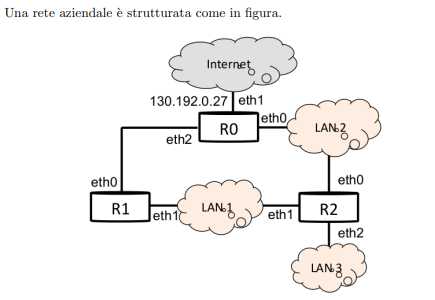

## TCP

### Esercizio 1

> ***Consideriamo una connessione TCP su cui viene trasferito un file di dimensioni***
> ***molto grandi, dove quindi possiamo trascurare il transitorio iniziale legato allo***
> ***slow start. La `receiver window è posta a 64kbyte` (il massimo ammesso senza***
> ***l’opzione di ”scaling window”). La velocità di trasmissione a livello fisico e***
> ***di `1Gbit/s`, mentre l’RTT (Round Trip Time) e dominato da un ritardo di***
> ***propagazione di `110ms`.***

**`1. Si calcoli il numero di segmenti a cui corrisponde la receiver window se la MTU di IP è quella consentita dalle normali reti Ethernet.`**
$$
MTU_{ip} = 1500\hspace{0.1cm}B \\
MSS = 1500 - H_{ip} - H_{tcp} = 1500 - 20 - 20 = 1460 \hspace{0.1cm}B \\
RWND = 64 * 1024 = 65536 \hspace{0.1cm}B \\
RWND_{seg} = \frac{RWND}{MSS} = \frac{65536}{1460} = 44 + 1296 \hspace{0.1cm}B \\
$$
**`2. Si calcoli il throughput a regime ottenuto con questa connessione a livello applicativo e a livello IP.`**
$$
Th_{a} = \frac{RWND}{RTT} = \frac{64*1024*8}{0.22} = 2.38 Mbit/s \\
Th_{ip} = \frac{(1500*44 + 1296 + 40)*8}{RTT} = \frac{(1500*44 + 1336)*8}{0.22} = 2.44 Mbit/s \\
$$
**`3. All’istante t0 (istante arbitrario durante la trasmissione) viene perso un pacchetto IP; si disegni l’andamento della dimensione della congestion window (CNGWIN) dall’istante della perdita a quando la finestra ritorna al valore di regime pari alla receiver window.`**


**`4. Si ripeta l’esercizio al punto 3 nel caso in cui vengono persi tre segmenti consecutivi`**


**` Si ripeta infine questo esercizio (al punto 4.) nel caso in cui il primo segmento perso venga ri-perso quando viene ritrasmesso (i successivi due sono invece ritrasmessi in modo corretto).`**


### Esercizio 2

> **Si consideri la trasmissione, con il protocollo TCP, di un file di dimensione elevate. La velocita di trasmissione sulla rete e di 1Gbit/s, per cui si può considerare trascurabile il tempo di trasmissione sia dei segmenti che dei relativi acknowlegment. Il tempo di propagazione del segnale dal trasmettitore al ricevitore è di 45ms. La rete non è mai congestionata e quindi la misura degli RTT e sempre approssimativamente uguale; più precisamente è una variabile casuale uniformemente distribuita tra 45 e 47ms.**

**`1. Calcolare la stima (Estimated RTT - ERTT) di RTT che effettua TCP in queste condizioni, nel caso in cui ERTT viene inizializzato a 1s, per i primi 10 segmenti inviati.`**

**`2. Calcolare la stima della varianza DevRTT nelle stesse condizioni e quindi il valore del retransmission timeout che verrà impostato per ciascun pacchetto trasmesso, sempre per i primi 10 pacchetti inviati.`**

**Formule da utilizzare per popolare la tabella:**

EstimatedRTT = $(1 - \alpha)*EstimatedRTT + \alpha*SampleRTT$

DevRTT = $(1-\beta)*DevRTT + \beta*|SampleRTT - EstimatedRTT|$

RTO = $EstimatedRTT + 4*DevRTT$s

| N    | ERTT | RTT  | RTTDev | RTO  |
| ---- | ---- | ---- | ------ | ---- |
| 1    | 1000 | 0    | 1000   | 5000 |
| 2    | 880  | 46   | 958    |      |
| 3    | 775  | 46   |        |      |
| 4    |      | 46   |        |      |
| 5    |      | 46   |        |      |
| 6    |      |      |        |      |
| ...  |      |      |        |      |

## Routing

### Esercizio 1



> **Il router R0 è collegato ad Internet con l’indirizzo IP pubblico 130.192.0.27. Alla LAN3 sono assegnati gli indirizzi `130.192.1.128/25`, mentre alle LAN1/2 devono essere assegnate due diverse subnet IP private, a LAN 1 con network `mask /23` e a LAN 2 con network `mask /20`.**

**`1 Assegnare gli indirizzi IP alle LAN 1 e LAN 2.`** 

**LAN 1** $172.16.0.0/23$

**LAN 2** $172.16.16.0/20$

**`2 Definire in binario il net-id delle reti LAN1 LAN2 e LAN3.`** 

**LAN 1** $10101100.00010000.0.0$

**LAN 2** $10101100.00010000.00010000.0$

**LAN 3** $10000010.11000000.00000001.10000000$

**`3 Assegnare gli indirizzi IP alle interfacce ethernet dei router R0, R1, R2`.** 

Rete R0 e R1: 192.168.0.0/30

**R0**

1. eth1 : 130.192.0.27
2. eth0 : 172.16.16.1
3. eth2 : 192.168.0.1

**R1**

1. eth0 : 192.168.0.2
2. eth1 : 172.16.0.1

**R2**

1. eth1 : 172.16.0.2
2. eth0 : 172.16.0.2
3. eth2 : 130.192.1.129    

**`4 Come devono essere configurate le tabelle di routing degli host di LAN2?`** 

| D - Destination   | NH - Next Hop | ETH  |
| ----------------- | ------------- | ---- |
| 172.16.16.0/20    | DC            | DC   |
| 172.16.0.0/23     | R2 ETH0       | //   |
| 130.192.1.128 /25 | R2 ETH0       | //   |
| 0.0.0.0 /0        | R0 ETH0       | //   |

 

**`5 Se si desidera spezzare la rete fisica LAN2 in sottoreti logiche diverse a livello IP, tutte con indirizzamento /24 come bisogna ri-assegnare gli indirizzi a host e specialmente ai router per farlo correttamente?`**

/20 -> /24 Si creano 16 sottoreti diverse, di cui ignuna avrebbe bisogno di un default gatway. Ogni router avrebbe 16 interfacce differenti (virtuali) con assegnato un indirizzo per ogni rete.

### Esercizio 3

> **Si consideri la topologia in Figura 1. Tenuto conto che i router utilizzano il protocollo OSPF e che i link sono simmetrici:**


**`1 Calcolare mediante l’algoritmo visto a lezione le tabelle di routing dei nodi A ad E.`** 

| n         | D(B),p(B) | D(C),p(C) | D(D),p(D) | D(E),p(E) | D(F),p(F) |
| --------- | --------- | --------- | --------- | --------- | --------- |
| **A**     | **1, A**  | 10,A      | /         | /         | 5,A       |
| A**B**    | /         | 10,A      | 9,B       | **3,B**   | 5,A       |
| AB**E**   | /         | 10,A      | 6,E       | /         | **4,E**   |
| ABE**F**  | /         | 7,F       | **6,E**   | /         | /         |
| ABEF**D** | /         | **7,F**   | /         | /         | /         |
| ABEFDC    | /         | /         | /         | /         | /         |

| n          | D(B),p(B) | D(C),p(C) | D(D),p(D) | D(A),p(A) | D(F),p(F) |
| ---------- | --------- | --------- | --------- | --------- | --------- |
| E          | 2,E       | /         | 3,E       | /         | **1,F**   |
| E**F**     | **2,E**   | 4,F       | 3,E       | 6,F       | /         |
| EF**B**    | /         | 4,F       | 3,E       | **3,B**   | /         |
| EFB**A**   | /         | 4,F       | **3,E**   | /         | /         |
| EFBA**D**  | /         | **4,F**   | /         | /         | /         |
| EFBAD**C** | /         | /         | /         | /         | /         |

**`2 Disegnare l’albero dei percorsi così ottenuti (il cosiddetto ”minimum spanning tree”) a partire da A e da E`** 


**`3 Quanti messaggi vengono inviati nella rete nel caso in cui il nodo A distribuisca in flooding i costi dei propri link? E nel caso del nodo E?`** 

Nel caso di A 9 messaggi e nel caso di E, ancora 9.

**`4 Come cambia la risposta al punto 3 se i link delle reti BDE e ACF formano un’unica sottorete fisica (Figura 2)? Perchè?`**

5 perchè nelle stesse reti viene inviato un broadcast.

### Esercizio 3


> **Una azienda ha un accesso a Internet attraverso un router ed una rete interna divisa in otto sottoreti “routate” come indicato nella figura. Le otto sottoreti sono quattro normali o pubbliche e quattro (LANPn) interne o private. Tutte le otto sottoreti sono di tipo /24. L’azienda possiede il seguente pool di indirizzi pubblici: 130.175.4.0/22, mentre l’indirizzo per l’interfaccia verso Internet `e assegnato da un pool a disposizione dell’ISP, ad esempio 120.120.0.0/16.**

**`1 Assegnare opportunamente gli indirizzi IP pubblici e privati alle otto sottoreti sulle otto LAN dell’azienda, specificando anche la network mask.`**

```
LAN 1 -> 130.175.4.0 /24
LAN 2 -> 130.175.5.0 /24
LAN 3 -> 130.175.6.0 /24
LAN 4 -> 130.175.7.0 /24
LP1 -> 192.168.1.0 /24
LP2 -> 192.168.2.0 /24
LP3 -> 192.168.3.0 /24
LP4 -> 192.168.4.0 /24
```

**`2 Assegnare gli indirizzi a tutte le interfacce di rete dei router, tenendo conto che ciascun router ha 4 interfacce di rete tranne R4 che ne ha solo 3 ovviamente.`** 

```
R1 - R2 = 192.168.0.0 /30
R2 - R3 = 192.168.0.4 /30
R3 - R4 = 192.168.0.8 /30

R1.eth0 120.120.0.1 /16
R1.eth1 192.168.1.1 /24
R1.eth2 192.168.0.1 /30
R1.eth3 130.175.4.0 /24

R2.eth0 192.168.0.2 /30
R2.eth1 192.168.2.1 /24
R2.eth2 192.168.0.5 /30
R2.eth3 130.175.5.1 /24

R3.eth0 192.168.0.6 /30
R3.eth1 192.168.3.1 /24
R3.eth2 192.168.0.9 /30
R3.eth3 130.175.6.1 /24

R4.eth0 192.168.0.10 /30
R4.eth1 192.168.4.1 /24
R4.eth3 130.175.7.1 /24
```

**`3 Definire le tabelle di routing di R2 ed R4`**

**R4**

| D               | NH      | ETH     |
| --------------- | ------- | ------- |
| 192.168.0.8 /30 | DC      | R4.eth0 |
| 192.168.4.0 /24 | DC      | R4.eth1 |
| 130.175.7.0 /24 | DC      | R4.eth3 |
| 0.0.0.0 /0      | R3.eth2 | R4.eth0 |
|                 |         |         |
|                 |         |         |
|                 |         |         |
|                 |         |         |
|                 |         |         |

